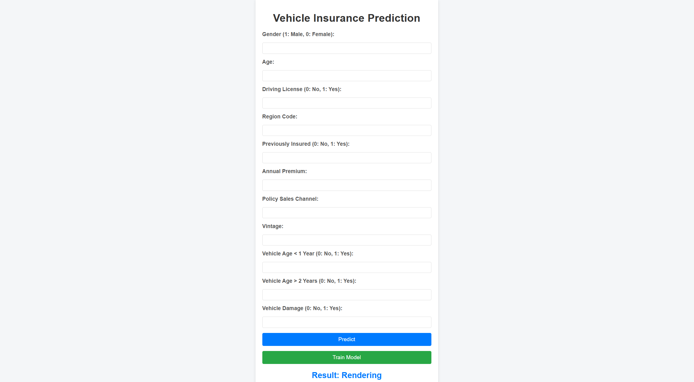

<div align="center">

# 🚗 Vehicle Insurance Prediction — End-to-End MLOps Pipeline

[](https://www.python.org/)
[](https://fastapi.tiangolo.com/)
[](https://www.mongodb.com/atlas)
[](https://aws.amazon.com/)
[](https://www.docker.com/)
[](https://github.com/features/actions)
[](https://scikit-learn.org/)

**A production-grade Machine Learning Operations (MLOps) project that predicts whether a vehicle owner will be interested in purchasing vehicle insurance.** Built with a modular architecture, automated CI/CD pipelines, cloud-native storage, and a real-time prediction web interface.

---

</div>

## 📸 Web Application Preview

<div align="center">

<br/>
<em>Real-time prediction interface — enter customer details, hit Predict, and get instant results.</em>
</div>

---

## 🎯 Problem Statement

An insurance company wants to identify customers from its existing health insurance policy base who might also be interested in **vehicle insurance**. Building a predictive model helps the company plan its communication strategy, optimize outreach, and improve revenue through targeted cross-selling.

The model predicts a binary outcome:
- **Response-Yes** → Customer is likely interested in vehicle insurance
- **Response-No** → Customer is unlikely to be interested

---

## ✨ Key Features

| Feature | Description |
|---|---|
| **Modular ML Pipeline** | Separate, reusable components for ingestion, validation, transformation, training, evaluation & pushing |
| **MongoDB Atlas Integration** | Cloud-hosted NoSQL database for scalable data storage and retrieval |
| **AWS S3 Model Registry** | Production models versioned and stored in S3 for seamless deployment |
| **Automated CI/CD** | GitHub Actions workflow builds Docker images, pushes to ECR, and deploys to EC2 |
| **Real-Time Predictions** | FastAPI-powered web app with a clean UI for instant inference |
| **Model Retraining on Demand** | `/train` endpoint to retrigger the full training pipeline without redeployment |
| **Imbalanced Data Handling** | SMOTEENN (SMOTE + Edited Nearest Neighbours) to address class imbalance |
| **Schema Validation** | YAML-driven schema checks ensure data quality before training |
| **Custom Logging & Exception Handling** | Rotating file logs with structured error tracebacks for observability |
| **Dockerized Deployment** | Lightweight `python:3.10-slim-buster` image for consistent, portable deployments |

---

## 🏗️ Architecture & Workflow

```
┌──────────────────────────────────────────────────────────────────────────┐
│                         TRAINING PIPELINE                                │
│                                                                          │
│  ┌──────────────┐   ┌──────────────┐   ┌───────────────────┐            │
│  │   MongoDB     │──▶│    Data      │──▶│      Data         │            │
│  │   Atlas       │   │  Ingestion   │   │   Validation      │            │
│  └──────────────┘   └──────────────┘   └───────────────────┘            │
│                                                │                         │
│                                                ▼                         │
│  ┌──────────────┐   ┌──────────────┐   ┌───────────────────┐            │
│  │  Model       │◀──│   Model      │◀──│      Data         │            │
│  │  Evaluation  │   │  Trainer     │   │  Transformation   │            │
│  └──────────────┘   └──────────────┘   └───────────────────┘            │
│         │                                                                │
│         ▼                                                                │
│  ┌──────────────┐   ┌──────────────────────────────────────┐            │
│  │  Model       │──▶│         AWS S3 Model Registry        │            │
│  │  Pusher      │   │     (my-model-mlopsprojkar bucket)   │            │
│  └──────────────┘   └──────────────────────────────────────┘            │
│                                                                          │
└──────────────────────────────────────────────────────────────────────────┘

┌──────────────────────────────────────────────────────────────────────────┐
│                        PREDICTION PIPELINE                               │
│                                                                          │
│  ┌──────────────┐   ┌──────────────┐   ┌───────────────────┐            │
│  │  User Input  │──▶│  FastAPI     │──▶│  S3 Model Load    │            │
│  │  (Web Form)  │   │  Endpoint    │   │  & Predict        │            │
│  └──────────────┘   └──────────────┘   └───────────────────┘            │
│                                                                          │
└──────────────────────────────────────────────────────────────────────────┘

┌──────────────────────────────────────────────────────────────────────────┐
│                          CI/CD PIPELINE                                   │
│                                                                          │
│  GitHub Push ──▶ GitHub Actions ──▶ Docker Build ──▶ AWS ECR             │
│                                                         │                │
│                         EC2 (Self-Hosted Runner) ◀──────┘                │
│                         docker run ──▶ App Live on :5000                 │
│                                                                          │
└──────────────────────────────────────────────────────────────────────────┘
```

---

## 🛠️ Tech Stack

<table>
<tr>
<td><b>Category</b></td>
<td><b>Technology</b></td>
</tr>
<tr><td>Language</td><td>Python 3.10</td></tr>
<tr><td>ML Framework</td><td>scikit-learn (RandomForestClassifier)</td></tr>
<tr><td>Data Balancing</td><td>imbalanced-learn (SMOTEENN)</td></tr>
<tr><td>Feature Scaling</td><td>StandardScaler, MinMaxScaler (sklearn Pipeline + ColumnTransformer)</td></tr>
<tr><td>Web Framework</td><td>FastAPI + Uvicorn + Jinja2 Templates</td></tr>
<tr><td>Database</td><td>MongoDB Atlas (Cloud NoSQL)</td></tr>
<tr><td>Cloud Provider</td><td>AWS — S3 (model registry), ECR (container registry), EC2 (deployment)</td></tr>
<tr><td>Containerization</td><td>Docker (python:3.10-slim-buster)</td></tr>
<tr><td>CI/CD</td><td>GitHub Actions (self-hosted runner on EC2)</td></tr>
<tr><td>Serialization</td><td>dill, pickle, NumPy (.npy)</td></tr>
<tr><td>Config Management</td><td>YAML (schema.yaml, model.yaml)</td></tr>
<tr><td>EDA & Visualization</td><td>pandas, NumPy, matplotlib, seaborn, plotly</td></tr>
<tr><td>Logging</td><td>Python logging with RotatingFileHandler</td></tr>
<tr><td>SDK / Clients</td><td>boto3, pymongo, certifi</td></tr>
</table>

---

## 📁 Project Structure

```
MlOps-Proj1/
│
├── .github/workflows/
│   └── .aws.yaml                  # CI/CD pipeline — GitHub Actions → ECR → EC2
│
├── config/
│   ├── model.yaml                 # Model configuration
│   └── schema.yaml                # Dataset schema for validation & transformation
│
├── notebook/
│   ├── data.csv                   # Raw dataset
│   ├── exp-notebook.ipynb         # EDA & Feature Engineering notebook
│   └── mongoDB_demo.ipynb         # MongoDB data upload demo
│
├── src/
│   ├── cloud_storage/
│   │   └── aws_storage.py         # S3 operations (upload, download, model load)
│   ├── components/
│   │   ├── data_ingestion.py      # Fetch data from MongoDB → train/test split
│   │   ├── data_validation.py     # Schema & column validation
│   │   ├── data_transformation.py # Feature engineering, scaling, SMOTEENN
│   │   ├── model_trainer.py       # RandomForest training & metric evaluation
│   │   ├── model_evaluation.py    # Compare new model vs production model (S3)
│   │   └── model_pusher.py        # Push accepted model to S3 bucket
│   ├── configuration/
│   │   ├── aws_connection.py      # boto3 S3 client/resource setup
│   │   └── mongo_db_connection.py # PyMongo client with TLS & timeout config
│   ├── constants/
│   │   └── __init__.py            # All project-wide constants & hyperparameters
│   ├── data_access/
│   │   └── proj1_data.py          # MongoDB → DataFrame exporter (batch fetch)
│   ├── entity/
│   │   ├── artifact_entity.py     # Dataclasses for pipeline artifacts
│   │   ├── config_entity.py       # Dataclasses for pipeline configuration
│   │   ├── estimator.py           # MyModel wrapper (preprocessor + model)
│   │   └── s3_estimator.py        # S3-backed estimator (load/save/predict)
│   ├── exception/
│   │   └── __init__.py            # Custom exception with traceback details
│   ├── logger/
│   │   └── __init__.py            # Rotating file + console logger
│   ├── pipline/
│   │   ├── training_pipeline.py   # Orchestrates all training components
│   │   └── prediction_pipeline.py # Handles real-time prediction requests
│   └── utils/
│       └── main_utils.py          # YAML, dill, NumPy save/load helpers
│
├── static/css/
│   └── style.css                  # Web app styling
├── templates/
│   └── vehicledata.html           # Jinja2 prediction form template
│
├── app.py                         # FastAPI application entry point
├── Dockerfile                     # Container build instructions
├── .dockerignore                  # Files excluded from Docker context
├── demo.py                        # Quick-run script for training pipeline
├── template.py                    # Project scaffolding / file generator
├── setup.py                       # Package installation (pip install -e .)
├── pyproject.toml                 # Build system configuration
└── requirements.txt               # Python dependencies
```

---

## 🔄 Pipeline Components in Detail

### 1. Data Ingestion
- Connects to **MongoDB Atlas** via `pymongo` with TLS certificate verification
- Exports the entire collection as a pandas DataFrame in configurable batch sizes
- Performs **train/test split** (75/25 ratio) and saves artifacts as CSV

### 2. Data Validation
- Reads dataset schema from `config/schema.yaml`
- Validates **column count**, **numerical columns**, and **categorical columns**
- Produces a JSON validation report — pipeline halts if validation fails

### 3. Data Transformation
- **Gender mapping** (Male→1, Female→0), dummy variable creation, column renaming
- Drops unnecessary columns (`_id`)
- Applies **StandardScaler** on `Age`, `Vintage` and **MinMaxScaler** on `Annual_Premium`
- Handles class imbalance with **SMOTEENN** (hybrid over/under-sampling)
- Saves preprocessor pipeline object and transformed `.npy` arrays

### 4. Model Training
- Trains a **Random Forest Classifier** with tuned hyperparameters:
  - `n_estimators=200`, `max_depth=10`, `criterion=entropy`
  - `min_samples_split=7`, `min_samples_leaf=6`, `random_state=101`
- Evaluates with **Accuracy, F1-Score, Precision, Recall**
- Rejects model if accuracy falls below **0.6 threshold**
- Bundles preprocessing pipeline + trained model into a single `MyModel` object

### 5. Model Evaluation
- Loads the current **production model from AWS S3**
- Compares new model's F1-score against production model
- Accepts the new model only if it **outperforms** the existing one (threshold: 0.02)

### 6. Model Pusher
- Uploads the accepted model to **AWS S3** bucket (`my-model-mlopsprojkar`)
- The pushed model becomes the new production model for the prediction pipeline

---

## 🚀 Getting Started

### Prerequisites
- Python 3.10+
- MongoDB Atlas account (free tier works)
- AWS account with S3, ECR, EC2 access
- Docker (for containerized deployment)

### 1. Clone the Repository
```bash
git clone https://github.com/your-username/MlOps-Proj1.git
cd MlOps-Proj1
```

### 2. Create & Activate Virtual Environment
```bash
conda create -n vehicle python=3.10 -y
conda activate vehicle
```

### 3. Install Dependencies
```bash
pip install -r requirements.txt
```

### 4. Set Environment Variables

```bash
# MongoDB
export MONGODB_URL="mongodb+srv://<username>:<password>@<cluster>.mongodb.net/?retryWrites=true&w=majority"

# AWS Credentials
export AWS_ACCESS_KEY_ID="your-access-key"
export AWS_SECRET_ACCESS_KEY="your-secret-key"
```

> **PowerShell users:** Replace `export` with `$env:VARIABLE_NAME = "value"`

### 5. Run the Training Pipeline
```bash
python demo.py
```

### 6. Launch the Web Application
```bash
python app.py
```
The app will be available at **`http://localhost:5000`**

---

## 🐳 Docker Deployment

```bash
# Build the image
docker build -t vehicle-insurance-prediction .

# Run the container
docker run -d \
  -e MONGODB_URL="your-mongodb-url" \
  -e AWS_ACCESS_KEY_ID="your-key" \
  -e AWS_SECRET_ACCESS_KEY="your-secret" \
  -p 5000:5000 \
  vehicle-insurance-prediction
```

---

## ⚙️ CI/CD Pipeline (GitHub Actions → AWS)

The project includes a fully automated deployment workflow:

```
Push to main → GitHub Actions triggers →
  ├── Continuous Integration (ubuntu-latest)
  │   ├── Checkout code
  │   ├── Configure AWS credentials
  │   ├── Login to Amazon ECR
  │   └── Build & push Docker image to ECR
  │
  └── Continuous Deployment (self-hosted EC2 runner)
      ├── Pull image from ECR
      └── Run container with env secrets on port 5000
```

### GitHub Secrets Required
| Secret | Description |
|---|---|
| `AWS_ACCESS_KEY_ID` | IAM user access key |
| `AWS_SECRET_ACCESS_KEY` | IAM user secret key |
| `AWS_DEFAULT_REGION` | AWS region (e.g., `us-east-1`) |
| `ECR_REPO` | ECR repository name |
| `MONGODB_URL` | MongoDB Atlas connection string |

---

## 📊 Dataset Features

| Feature | Type | Description |
|---|---|---|
| Gender | Categorical | Male / Female |
| Age | Integer | Age of the customer |
| Driving_License | Binary | 0 = No, 1 = Yes |
| Region_Code | Float | Unique code for the region |
| Previously_Insured | Binary | 0 = Not insured, 1 = Already insured |
| Vehicle_Age | Categorical | < 1 Year, 1-2 Years, > 2 Years |
| Vehicle_Damage | Categorical | Yes / No |
| Annual_Premium | Float | Amount paid annually |
| Policy_Sales_Channel | Float | Outreach channel code |
| Vintage | Integer | Days the customer has been associated |
| **Response** | **Binary (Target)** | **1 = Interested, 0 = Not interested** |

---

## 🧪 API Endpoints

| Method | Endpoint | Description |
|---|---|---|
| `GET` | `/` | Renders the prediction form |
| `POST` | `/` | Accepts form data and returns prediction |
| `GET` | `/train` | Triggers full model retraining pipeline |

---

## 🔐 Security Best Practices

- All sensitive credentials (MongoDB URL, AWS keys) are managed via **environment variables** — never hardcoded
- GitHub Secrets used for CI/CD pipeline — no credentials in source code
- AWS IAM users follow **least privilege** principle
- MongoDB network access configured with IP whitelisting
- Docker images use a minimal **slim-buster** base to reduce attack surface

---

## 📝 License

This project is licensed under the MIT License — see the [LICENSE](LICENSE) file for details.

---

<div align="center">

**Built with ❤️ by [Karthik Singidi](mailto:singidikarthik1434@gmail.com)**

*If you found this project useful, consider giving it a ⭐ on GitHub!*

</div>
